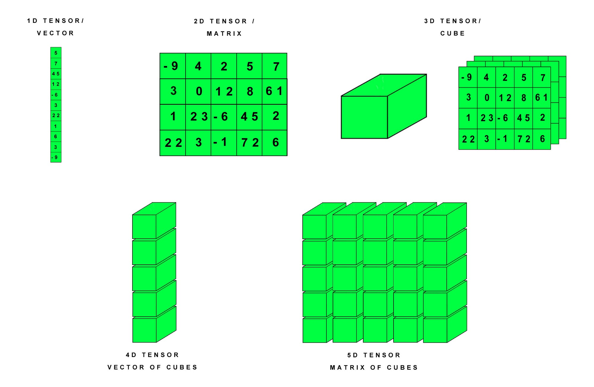
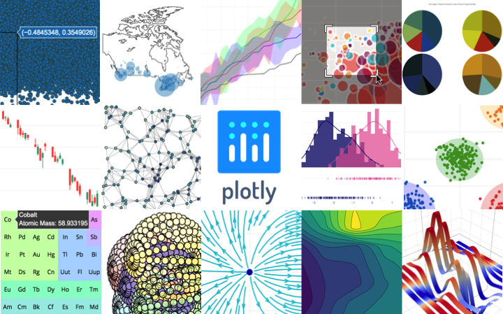

# Cassava-Leaf-Disease

# (I) Abstract : 

Misdiagnosis of the many diseases have a colossal impact on agricultural crops which in turn leads to misuse of chemicals leading to the emergence of resistant pathogen strains, increased input costs, and more outbreaks with significant economic loss and environmental impacts. Existing methods of disease detection require farmers to solicit the help of government-funded agricultural experts to visually inspect and diagnose the plants. This suffers from being *labor-intensive, low-supply and costly*. This endeavor of ours aims to leverage the potential of **computer vision** and **machine learning** to *automatically identify the diseases in the leaves when the corresponding image is fed into the network*.

This project was part of Cassava Leaf Disease Classification Challenge hosted in *kaggle* :

https://www.kaggle.com/c/cassava-leaf-disease-classification

# (II) Dataset Used : 

In this competition, the provided dataset consists of 21,367 labeled images collected during a regular survey in Uganda. Most images were crowdsourced from farmers taking photos of their gardens, and annotated by experts at the National Crops Resources Research Institute (NaCRRI) in collaboration with the AI lab at Makerere University, Kampala. This is in a format that most realistically represents what farmers would need to diagnose in real life.

Link to the dataset: https://www.kaggle.com/c/cassava-leaf-disease-classification/data

The dataset composed of about :
* 21,367 labeled images. Each images belongs to either of the mentioned category :
  * Cassava Bacterial Blight (CBB)
  * Cassava Brown Streak Disease (CBSD)
  * Cassava Green Mottle (CGM)
  * Cassava Mosaic Disease (CMD)
  * Healthy
  
Some sample images from each categories :

# (III) Libraries used :

## Numpy :

NumPy is a library for the Python programming language, adding support for large, multi-dimensional arrays and matrices, along with a large collection of high-level mathematical functions to operate on these arrays.

## Plotly :

Plotly is an interactive, open-source, and browser-based graphing library for Python. 

## Fastai

fast.ai is a non-profit research group focused on deep learning and artificial intelligence. It was founded in 2016 by Jeremy Howard and Rachel Thomas with the goal of democratising deep learning.

## Pytorch

PyTorch is an open source machine learning library based on the Torch library, used for applications such as computer vision and natural language processing, primarily developed by Facebook's AI Research lab (FAIR).

## OpenCV

OpenCV (Open Source Computer Vision Library) is a library of programming functions mainly aimed at real-time computer vision.

## Albumentations

Albumentations is a fast and flexible image augmentation library. The library is widely used in industry, deep learning research, machine learning competitions, and open source projects.

# (IV) Exploratory Data Analysis(EDA) : 

Firstly, a pie chart was plotted which gives the overview of whole dataset

Secondly, the color channel distributions were analyzed for the images from the dataset and plotted using plotly :

# (IV) Architecture Used :

## EfficientNet Architecture

A portion from the paper : https://arxiv.org/abs/1905.11946

In our ICML 2019 paper, “EfficientNet: Rethinking Model Scaling for Convolutional Neural Networks”, we propose a novel model scaling method that uses a simple yet highly effective compound coefficient to scale up CNNs in a more structured manner. Unlike conventional approaches that arbitrarily scale network dimensions, such as width, depth and resolution, our method uniformly scales each dimension with a fixed set of scaling coefficients.

## EfficientNet Performance

# (V) Result :

## The achieved accuracy is almost 90% using techniques like CutMix, Label Smoothing, etc..

# Thank you for your time to read this far ~~
