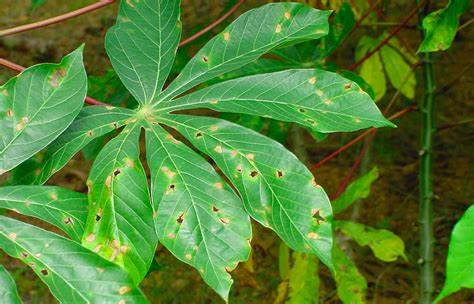

# Cassava-Leaf-Disease

# (I) Abstract : 

Misdiagnosis of the many diseases have a colossal impact on agricultural crops which in turn leads to misuse of chemicals leading to the emergence of resistant pathogen strains, increased input costs, and more outbreaks with significant economic loss and environmental impacts. Current disease diagnosis based on human scouting is *time-consuming and expensive*. This endeavor of ours aims to leverage the potential of **computer vision** and **machine learning** to *automatically identify the diseases in the leaves when the corresponding image is fed into the network*.
